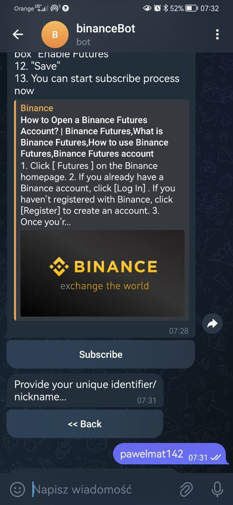

## 1. Description

Application is a bot that works with the Telegram API and the Binance crypto exchange API.


### 1.1. Signals

<div style="display: flex; gap: 20px">
    <div>
        <p>The bot listens to signal channels on Telegram. Signals are text messages containing futures position information such as</p>
        <ul>
            <li>currency pair</li>
            <li>position side - LONG/SHORT</li>
            <li>stop loss level</li>
            <li>take profit level or levels</li>
            <li>leverage</li>
        </ul>
        </br>
        <p>Properly formatted signals are processed in real-time into positions on Binance Futures for each active subscription.</p>
        <p>It is possible to support multiple signal sources. By default, signals formatted as shown in the screenshot will be supported, but there is an option to handle differently formatted messages by implementing an extension of the <strong>SignalValidator</strong> class </p>
    </div>
    
</div>


### 1.2. Positions 

        
   

<!-- TODO -->
<!-- 
It is also possible to support multiple Binance accounts. The account creation process is carried out via Telegram in the form of a chatbot and requires a unique Binance API key with permission to play on Futures.

The account creation process takes place via Telegram Bot API, which ensures authentication and authorization. During the process, the unique Binance API key is checked. This means that there is no login and registration system here. You are logged in to Telegram - you have access to your bot.

After creating an account, you can manage it via Telegram, also in the form of a chatbot. Options are:
- manage USDT amount per transaction for each signal source
- view positions or orders
- close position with current market price
- add/remove position stop loss (addtional button to move SL to entry price)
- add/remove position take profits
- activte / deactivate account (inactive account will not open more positions)

The effectiveness of the bot depends on the effectiveness of analyses/signals. -->

</br>

     

## 2. Technologies
- NestJS
- Telegram MtProto Protocol
- Telegram Bot API
- Binance Futures API

</br>

## 3. Setup

### 3.1. Requirements

- <strong>3.1.1.</strong> Node.js installed

- <strong>3.1.2.</strong> Access to Telegram channel with signal messages. [Here's how to get the channel ID explained](https://neliosoftware.com/content/help/how-do-i-get-the-channel-id-in-telegram/)

- <strong>3.1.3.</strong> Your Telegram <strong>api_id</strong> and <strong>api_hash</strong> are required to start application listening for signal messages. [Here's how to obtain them explained](https://core.telegram.org/api/obtaining_api_id).

- <strong>3.1.4.</strong> Active Binance Futures account.

- <strong>3.1.5.</strong> You will need to set up a Telegram Bot that allows users to subscribe to this app using their Binance accounts. To create the bot and obtain the <strong>Token</strong>, simply type `/newbot` in a chat with the [BotFather](https://web.telegram.org/a/#93372553) on Telegram and follow the instructions provided.
- <strong>3.1.6.</strong> MongoDB access. The simplest way to access a MongoDB database is by creating an account on [MongoDB Atlas](https://account.mongodb.com/account/login) and obtaining the connection <strong>URI</strong>.


### 3.2. Steps

#### 3.2.1 Run the application:

- Create project directory, open it with terminal and run: 
```
git clone https://github.com/pawelmat142/binance-bot.git ./
npm i
```
- Create a file named `.env` in the project directory and fill required environment variables: 
```
MONGO_URI=<see 3.1.6.>

TELEGRAM_API_ID=<see 3.1.3.>
TELEGRAM_API_HASH=<see 3.1.3.>
TELEGRAM_PHONE_NUMBER=<see 3.1.3.>

TELEGRAM_BOT_PUBLIC_CHANNEL_TOKEN=<see 3.1.5.>
```
- Create a file named `signal-sources.json` in the project directory and populate it with the channel_id obtained in step 3.1.2.:

```
[
    {
        "name": "DEFAULT",
        "telegramChannelId": "<channel_id>"
    }
]
```
Note: Multiple channels may be provided here, allowing the application to listen to several channels simultaneously. 
- Now run in the terminal: 
```
npm start
```
- Once the application is running, you will be prompted to enter a login code. This code will be sent to you via Telegram:


- The application is now listening for incoming messages on the specified channels. If the messages meet the signal criteria, they will be processed for all active subscriptions.

- In the next step, how to add subscriptions will be explained. 

#### 3.2.2 Subscribe with Binance Futures account

- By Telegram send any message to bot what you created in step <strong>3.1.5</strong>
- Select `How to generate API key?` The bot will explain how to generate API key...
- After generating the API keys, select `Subscribe` and follow the instructions to complete your subscription.
- After activating the subscription, the bot will automatically manage positions related to incoming signals in real time.


|  |  |  
|--------------------------------------|---------------------------------------------|--------------------------------------|
|  |  

